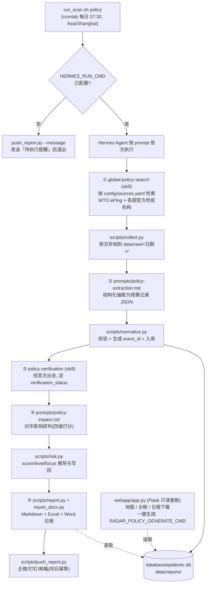

# ARCHITECTURE.md · 系统架构与数据流

> 本分支只监测**外国政府/国际组织动植物检疫政策变化**（`record_type=policy`）。疫情事件管线已移除，勿重新引入。字段权威定义见 `docs/event-schema.md`，运行约定见 `AGENTS.md`。

## 1. 整体流程



两条触发路径殊途同归：

1. **定时路径**：crontab → `run_scan.sh policy` → Hermes 无头执行完整五段流程 → 日报 + 推送。
2. **面板路径**：浏览器点"生成今日政策日报" → webapp 执行 `RADAR_POLICY_GENERATE_CMD`（默认即 `report.py --excel --docx`），只重新汇编已入库记录，不触发检索。

## 2. 各环节的输入输出规范

### 2.1 global-policy-search（skill，检索入口）

| 项 | 内容 |
|---|---|
| 输入 | `config/sources.yaml`：`sources`（measures 覆盖的官方源）、`policy_watch_countries`（priority_1/2/state_level）、`policy_keywords`（六类词库）、`policy_queries`（按主题分组的检索模板） |
| 职责 | 按国家优先级 × 主题面组合检索；只收录**政策动作**，不收集疫情事件；不采集中国海关总署 |
| 输出 | 每条线索经 `collect.py` 存档到 `data/raw/<日期>/`（网页 + `.meta.json`）；搜索过程记入 `data/raw/<日期>/search-log.md`；抽取后的政策 JSON 交给下一环 |

### 2.2 prompts/policy-extraction.md（结构化抽取）

| 项 | 内容 |
|---|---|
| 输入 | `data/raw/` 中的存档原文 |
| 约束 | 产出的 JSON 必须满足 `docs/event-schema.md`：枚举值用中文，`source.url` + `source.quote`（≤120 字）必填，**原文没有的信息填 null，严禁编造** |
| 输出 | 政策记录 JSON（可经 stdin 喂给 `normalize.py --input -`） |

### 2.3 scripts/normalize.py（数据合同权威实现）

| 项 | 内容 |
|---|---|
| 输入 | 政策记录 JSON（`--input`，支持 `-` 读 stdin）；`--db` 写库；`--out` 写 `data/events/<日期>/` |
| 校验 | `record_type=policy`；必填 `country_cn/country_en/source`；action_type/policy_domain/impact_type/impact_level/china_relevance/verification_status 枚举强校验 |
| event_id | `sha1(policy\|country_en\|policy_domain\|action_type\|主体\|生效日期)` 前 12 位，幂等主键 |
| 合并策略 | 重复入库默认合并更新：空值与 `DEFAULT_SENTINELS`（`verification_status=unverified`、`policy_status=已生效`）不覆盖已有核验/研判结论；整行替换须显式 `--replace` |

### 2.4 policy-verification（skill，官方核验）

| 项 | 内容 |
|---|---|
| 输入 | 待核验政策记录 + 其 `source.url` 原文 |
| 官方优先级 | 政府公报/检疫机构公告 → WTO ePing 通报原文（G/SPS/N 编号）→ 国际组织正式决定 → 权威媒体（仅作线索，必须回溯原文） |
| 输出 | `verification_status`：verified / single_source / unverified / false_positive（内部合并用 merged，由代码产生，不手写） |

### 2.5 prompts/policy-impact.md（对华影响研判）+ scripts/risk.py（写回）

| 项 | 内容 |
|---|---|
| 输入 | 已核验政策记录 + 中国贸易背景（海关总署公告**仅作背景**，不入台账） |
| 加权合同 | `impact_score = trade*0.35 + biosecurity*0.30 + response*0.25 + alignment*0.10`；≥3.5 高影响 / ≥2.0 中影响 / 其余低影响；高→立即关注、中→持续观察、低→常规记录 |
| 写回 | `risk.py --event-id <id> --dim trade=4 --dim biosecurity=3,...`；四维齐全时 score/level/focus 由代码推导并强校验，不得手写冲突值；`--list-pending` 列出待研判记录 |
| 输出 | 写回库中的 `impact_score / impact_level / impact_focus / impact_type / china_relevance / recommended_action / rationale` |

### 2.6 report.py / report_docx.py / push_report.py（日报与推送）

| 项 | 内容 |
|---|---|
| report.py | 按日期聚合库中记录 → Markdown 速览（政策速览/详情/影响综述/待办/统计/来源）+ Excel 台账（缺 openpyxl 降级 CSV） |
| report_docx.py | Word 简报（缺 python-docx 跳过） |
| push_report.py | 企微/钉钉(加签)/SMTP 邮箱，配哪个发哪个；`--dry-run` 只打印；**同日幂等**（`data/reports/.pushed/<日期>.flag`），重发需 `--force`；摘要结构 = 重点关注(中影响/收紧) + 其他新增，每条附原文链接 |

## 3. 数据库 schema 与索引策略

SQLite（生产路径由 `EPIDEMIC_DB` 指定，默认 `database/epidemic.db`），**单表宽 JSON** 设计：

```sql
CREATE TABLE events (
  event_id            TEXT PRIMARY KEY,   -- sha1(...) 前 12 位, 幂等主键
  payload             TEXT NOT NULL,      -- 完整政策记录 JSON(权威数据)
  disease_en          TEXT,               -- 冗余列, 供旧工具兼容
  country_en          TEXT,
  category            TEXT,
  event_date          TEXT,
  verification_status TEXT,
  impact_level        TEXT,
  impact_focus        TEXT,
  updated_at          TEXT,
  record_type         TEXT                -- 后加列(ALTER TABLE), 数据合同过滤用
);
CREATE INDEX idx_events_date  ON events(event_date);        -- 报告按日期聚合
CREATE INDEX idx_events_status ON events(verification_status); -- 待核实/待研判筛选
CREATE INDEX idx_events_type  ON events(record_type);        -- 面板/API 只取 policy
```

策略要点：

- **payload 是权威**：列只是查询用冗余投影；展示层从 payload JSON 读字段。改字段 = 改 payload 结构 + `docs/event-schema.md` + normalize/report 展示层，见 AGENTS.md 同步清单。
- **record_type=policy 过滤是硬要求**：webapp events API 必须显式 `record_type=policy` 才返回数据，防止旧疫情数据混入。
- **镜像 JSON**：`data/events/<日期>/*.json` 是入库镜像，便于 diff 与重建；库丢失可用 JSON 重放 `normalize.py` 重建。
- **迁移方式**：`open_db()` 幂等建表 + 缺列 `ALTER TABLE`，无独立迁移脚本；新增冗余列时照此模式补。
- **数据不入库（git）**：`data/raw|events|reports/`、`database/`、`logs/` 均 gitignore；生产用 `EPIDEMIC_DATA_DIR`/`EPIDEMIC_DB` 指到 repo 外（如 `/opt/global-epidemic-ai`）。

## 4. Hermes Agent 的调度逻辑

Hermes 是全流程唯一调度者；`scripts/` 只做确定性工具（校验、ID、推导、渲染、推送），不做任何 LLM 调用。

**调用模板**（`run_scan.sh`）：

```bash
# ~/.hermes/.env 中配置, {PROMPT} 为占位符
HERMES_RUN_CMD='hermes run --prompt "{PROMPT}"'
```

- `run_scan.sh [am|pm|policy]` 把对应扫描指令整段组装成 `{PROMPT}`（policy 档的 prompt 要求：检索→抽取→核验→研判→`report.py --excel --docx`→`push_report.py`），`cd "$REPO"` 后交给 Hermes（agent 依赖仓库相对路径，勿删 cd）。
- **未配置 `HERMES_RUN_CMD` 时的降级**：不执行扫描，改为调 `push_report.py --message` 向已配渠道发"待执行提醒"，确保漏扫可见。
- `~/.hermes/.env` 由 `run_scan.sh` 自动加载（推送渠道、`EPIDEMIC_*`、`HERMES_RUN_CMD` 都从这里来）。
- **技能分发**：Hermes 通过 `~/.hermes/skills/` 下的符号链接使用 `global-policy-search` / `policy-verification` / `daily-report` 三个仓库内 skill（部署见 README）。
- **每道工序后验货**：prompt 中要求 Hermes 在每段完成后核对产出数量与出处存在性再进下一段；某段失败不阻塞整体，失败记录留在对应状态（如待核实）下轮补跑。
- **幂等兜底**：即使同一批记录重复入库，event_id 合并策略保证核验/研判结论不被抹掉；同一天推送只发一次。

**cron 部署要点**（`config/crontab.example`）：服务器时区必须 Asia/Shanghai；cron 的 PATH 被精简，需在 crontab 顶部手工补 `PATH=` 行。

## 5. 代码运行时约束

- scripts 内**同级导入**（risk.py `from normalize import ...`）；report.py 与 webapp/app.py 靠 `sys.path.insert` 引入 scripts/ 与 templates/，因此一律从**仓库根目录**以 `python scripts/xxx.py` 运行。
- 依赖仅 openpyxl / python-docx / flask，全部**优雅降级**，不加硬依赖。
- 地理编码走 OSM Nominatim，缓存 `data/geocache.json`，`RADAR_GEO=0` 可关闭；同国多点做确定性偏移。
- 开发在 Windows（CJK 字体按 platform 选 Microsoft YaHei / Noto Sans CJK SC），生产是 Linux VPS。
